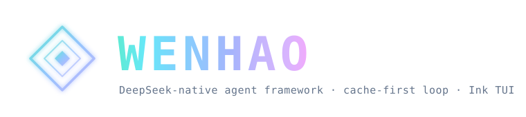

<p align="center">
  
</p>

<p align="center">
  <strong>简体中文</strong>
  &nbsp;·&nbsp;
  <a href="./README.md">English</a>
  &nbsp;·&nbsp;
  <a href="./docs/SPEC.md">规格 / Spec</a>
  &nbsp;·&nbsp;
  <a href="https://esengine.github.io/DeepSeek-Wenhao/">官方网站</a>
  &nbsp;·&nbsp;
  <strong><a href="https://discord.gg/XF78rEME2D">Discord</a></strong>
</p>

> [!IMPORTANT]
> **Wenhao 1.0 是用 Go 从零重写的版本** — 本分支（`main`）是新的默认分支，后续开发都在这里。
> 早期的 `0.x` TypeScript 版本转为 **legacy**，保留在 [`v1`](https://github.com/esengine/DeepSeek-Wenhao/tree/v1) 分支（仅维护）。
> 详见**[迁移指南](./docs/MIGRATING.md)**。`npm i -g wenhao` 仍是安装命令 —— `1.0.0`+ 装的是 Go 二进制，`0.x` 是 legacy TS 版。
>
> **Wenhao 1.0 is a ground-up rewrite in Go** — this branch (`main`) is the new default where development happens now.
> The earlier `0.x` TypeScript releases are **legacy**, living on the [`v1`](https://github.com/esengine/DeepSeek-Wenhao/tree/v1) branch (maintenance only).
> See the **[migration guide](./docs/MIGRATING.md)**. `npm i -g wenhao` stays the install command — `1.0.0`+ delivers the Go binary, `0.x` is the legacy TS build.

<p align="center">
  <a href="https://www.npmjs.com/package/wenhao"></a>
  <a href="https://github.com/esengine/wenhao/actions/workflows/ci.yml"></a>
  <a href="./LICENSE"></a>
  <a href="https://www.npmjs.com/package/wenhao"></a>
  <a href="https://github.com/esengine/wenhao/stargazers"></a>
  <a href="https://atomgit.com/esengine/DeepSeek-Wenhao"></a>
  <a href="https://github.com/esengine/wenhao/graphs/contributors"></a>
  <a href="https://github.com/esengine/wenhao/discussions"></a>
  <a href="https://discord.gg/XF78rEME2D"></a>
</p>

<p align="center">
  <a href="https://oosmetrics.com/repo/esengine/wenhao"></a>
  <a href="https://oosmetrics.com/repo/esengine/wenhao"></a>
  <a href="https://oosmetrics.com/repo/esengine/wenhao"></a>
</p>

<br/>

<h3 align="center">DeepSeek 原生 AI 编码代理 —— 你的终端里的 AI 工程师</h3>
<p align="center">一个由配置与插件驱动的极薄 harness —— 单一静态 Go 二进制，围绕 DeepSeek 的前缀缓存调优，长会话也能把 token 成本压低。</p>

<h3 align="center">A DeepSeek-native AI coding agent — your AI engineer in the terminal.</h3>
<p align="center">A config- and plugin-driven harness — a single static Go binary, tuned around DeepSeek's prefix cache so token costs stay low across long sessions.</p>

<br/>

> [!IMPORTANT]
> **加入社区 · Community** — 双语 Discord，提供安装答疑（`#help` / `#求助`）、工作流展示与功能想法。→ **<https://discord.gg/XF78rEME2D>**
>
> Bilingual Discord for setup help (`#help` / `#求助`), workflow showcases, and feature ideas. → **<https://discord.gg/XF78rEME2D>**

---

## 特性 / Features

| 中文 | English |
|------|---------|
| **配置驱动** — provider、agent、工具、插件全部在 `wenhao.toml` 中声明，内核无硬编码模型。 | **Configuration-Driven** — Providers, agent, enabled tools, and plugins are all declared in `wenhao.toml`. No hardcoded models in the kernel. |
| **多模型可组合** — DeepSeek（flash/pro）与 MiMo 作为预设内置；任何 OpenAI 兼容端点只需一条配置。支持 Anthropic Messages API 原生接入。 | **Multi-Model Composable** — DeepSeek (flash/pro) and MiMo ship as presets; any OpenAI-compatible endpoint is a config entry. Also supports Anthropic Messages API natively. |
| **MCP 插件生态** — stdio + Streamable HTTP 双传输，支持懒连接、工具列表缓存、连接诊断、OAuth 认证；兼容 Claude Code 的 `.mcp.json`。 | **MCP Plugin Ecosystem** — stdio + Streamable HTTP transports, with lazy connection, tool-list caching, connection diagnostics, OAuth; compatible with Claude Code `.mcp.json`. |
| **交互式终端界面** — 基于 Bubble Tea 的 TUI，Markdown 渲染 + Chroma 语法高亮，上下文仪表盘实时显示 token/活动/任务清单。 | **Interactive TUI** — Bubble Tea-based terminal UI with Markdown rendering, Chroma syntax highlighting, and a live context dashboard showing tokens, activity, and task list. |
| **双模型协同** — Planner + Executor 双模型，各自独立、缓存稳定的 session。Planner 只读研究后产出计划，Executor 负责执行。 | **Dual-Model Collaboration** — Planner + Executor in separate, cache-stable sessions. Planner researches read-only then hands a plan to the Executor for implementation. |
| **纯编排模式** — 主 agent 只做任务拆解和子代理调度，自己不直接执行工具调用，作为纯粹的「任务编排者」。 | **Pure Orchestrator Mode** — The main agent only decomposes tasks and schedules sub-agents, never executing tools directly — a pure task orchestrator. |
| **权限与沙箱** — allow/ask/deny 逐次调用把关；macOS Seatbelt 沙箱将 bash 和文件写工具限制在项目目录内，符号链接/`..` 安全。 | **Permission & Sandbox** — Per-call allow/ask/deny gating; macOS Seatbelt sandbox confines bash and file writers to the project directory, symlink/`..`-safe. |
| **内置开发工具** — 18+ 工具：read_file、write_file、edit_file、multi_edit、bash、ls、glob、grep、web_fetch、task、todo_write、ask、delete_range、delete_symbol、notebook_edit、complete_step、diff_preview 等。 | **Built-in Dev Tools** — 18+ tools: read_file, write_file, edit_file, multi_edit, bash, ls, glob, grep, web_fetch, task, todo_write, ask, delete_range, delete_symbol, notebook_edit, complete_step, diff_preview, and more. |
| **子代理与 Worktree 隔离** — 通过 `task` 工具派生子代理，可选 git worktree 隔离，并行处理复杂任务。 | **Subagent & Worktree Isolation** — Spawn sub-agents via the `task` tool with optional git worktree isolation for parallel complex task handling. |
| **Skill 系统** — 可复用 Playbook（SKILL.md），支持 inline 和 subagent 两种运行模式；内置 explore/research/review/security-review/test 五个技能。 | **Skill System** — Reusable playbooks (SKILL.md) with inline and subagent run modes; five built-in skills: explore, research, review, security-review, test. |
| **自定义斜杠命令** — `.wenhao/commands/*.md` 定义项目级或用户级命令，支持 frontmatter 元数据和 `$ARGUMENTS` 模板展开。 | **Custom Slash Commands** — `.wenhao/commands/*.md` defines project- or user-level commands with frontmatter metadata and `$ARGUMENTS` template expansion. |
| **@ 引用** — `@file`、`@dir`、`@server:uri` 三种引用语法，输入时弹出层级式补全菜单。 | **@ References** — `@file`, `@dir`, `@server:uri` injection with hierarchical autocomplete on typing `/` or `@`. |
| **CodeGraph 符号级代码智能** — callers/callees/impact/trace 调用链分析，基于 tree-sitter + SQLite 的符号级搜索。 | **CodeGraph Symbol-Level Intelligence** — callers/callees/impact/trace call-graph analysis with tree-sitter + SQLite symbol-level search. |
| **LSP 集成** — Go/Rust/Python/TypeScript/Bash 语言诊断和跳转，编辑器级代码理解能力。 | **LSP Integration** — Go/Rust/Python/TypeScript/Bash diagnostics and go-to-definition, bringing editor-grade code understanding. |
| **ACP v1 Editor 集成** — 通过 Agent Client Protocol v1 对接 VS Code 等编辑器，每个 Editor session 拥有独立 Controller。 | **ACP v1 Editor Integration** — Agent Client Protocol v1 for VS Code and other editors; each editor session gets its own Controller. |
| **对话分支与 Checkpoint** — `/tree` `/branch` `/switch` `/rewind`，git-free 对话回退和分支管理，每轮自动保存检查点。 | **Conversation Branches & Checkpoint** — `/tree`, `/branch`, `/switch`, `/rewind` for git-free conversation rollback and branching, with auto-checkpoint every turn. |
| **上下文压缩** — 智能压缩保持 DeepSeek prefix cache 热度，soft/hard/force 三级压缩阈值，CacheBoost 技术降低长会话成本。 | **Context Compaction** — Smart compaction preserves DeepSeek prefix cache warmth with soft/hard/force compression thresholds for low-cost long sessions. |
| **输出风格系统** — Persona 切换，内置 explanatory/learning/concise 多风格 + 自定义 `.wenhao/output-styles/*.md`。 | **Output Style System** — Persona switching with built-in styles (explanatory, learning, concise) and custom `.wenhao/output-styles/*.md`. |
| **项目记忆** — 层次化 WENHAO.md/AGENTS.md 记忆系统，`remember` 工具持久化，跨会话自动合并去重。 | **Project Memory** — Hierarchical WENHAO.md/AGENTS.md memory; `remember` tool for persistence; cross-session auto-merge and deduplication. |
| **会话持久化** — 保存/恢复/跨重启续接，对话历史不丢失。 | **Session Persistence** — Save/resume across restarts; conversation history is never lost. |
| **自动规划分类器** — 廉价模型判断任务复杂度，复杂任务自动进入只读规划模式，用户批准后执行。 | **Auto-Plan Classifier** — A cheap model judges task complexity; complex tasks auto-enter read-only plan mode, awaiting user approval before execution. |
| **桌面通知** — 跨平台系统通知，后台任务完成或需人工介入时弹窗提醒。 | **Desktop Notifications** — Cross-platform system notifications when background tasks complete or human input is needed. |
| **系统代理检测** — 自动检测操作系统代理设置，企业内网用户无需手动配置。 | **System Proxy Detection** — Auto-detect OS proxy settings; no manual configuration needed in corporate environments. |
| **文件编码检测** — 编辑前自动识别文件编码（UTF-8/UTF-16 LE/BE 等），防止编码问题。 | **File Encoding Detection** — Auto-detect file encoding before editing (UTF-8, UTF-16 LE/BE, etc.) to prevent encoding corruption. |
| **余额查询** — DeepSeek 钱包实时余额显示，用量一目了然。 | **Balance Query** — Real-time DeepSeek wallet balance display; usage at a glance. |
| **国际化** — 中英文双语 UI，通过 `language` 配置或 `$LANG` 环境变量自动检测。 | **i18n** — Bilingual Chinese/English UI, auto-detected via `language` config or `$LANG` environment variable. |
| **零依赖单二进制** — `CGO_ENABLED=0` 静态编译，唯一外部依赖是 TOML 解析器，一条命令交叉编译六目标平台。 | **Zero-Dependency Single Binary** — `CGO_ENABLED=0` static build; the only external dependency is a TOML parser; cross-compile six targets with one command. |
| **三种前端共享一个 Controller** — CLI TUI + HTTP/SSE + Wails Desktop，传输无关的 control.Controller 统一驱动。 | **Three Frontends, One Controller** — CLI TUI + HTTP/SSE + Wails Desktop, all driven by a transport-agnostic control.Controller. |
| **桌面客户端** — Wails v3 + React 原生桌面窗口，完整的 GUI 体验。 | **Desktop Client** — Wails v3 + React native desktop window for a full GUI experience. |
| **评审循环** — 代码生成后自动进入审查→修改循环，持续提升代码质量。 | **Review Loop** — Auto review→revise loop after code generation, continuously improving code quality. |
| **证据驱动步骤确认** — `complete_step` 工具要求每个步骤完成都有证据支撑，不可跳过。 | **Evidence-Driven Step Confirmation** — The `complete_step` tool requires verifiable evidence for every step completion. |

---

## 安装 / Installation

**npm（全平台通用 / all platforms）：**

```sh
npm i -g wenhao                  # 自动拉取对应平台的原生二进制
                                 # pulls the matching prebuilt native binary
```

**Homebrew（macOS）：**

```sh
brew install esengine/homebrew-wenhao/wenhao
```

**预编译归档 / Prebuilt archives：**

`darwin|linux|windows × amd64|arm64` 和 `SHA256SUMS` 见每个
[GitHub release](https://github.com/esengine/DeepSeek-Wenhao/releases)。

**从源码构建 / Build from source：**

```sh
make build      # -> bin/wenhao(.exe)
make cross      # -> dist/（darwin|linux|windows × amd64|arm64）
```

---

## 快速开始 / Quick Start

```sh
wenhao setup                      # 配置向导 → ./wenhao.toml
                                  # config wizard → ./wenhao.toml

export DEEPSEEK_API_KEY=sk-...    # 或写入 .env（见 .env.example）
                                  # or put it in .env (see .env.example)

wenhao chat                       # 交互式对话，然后运行 /init 生成 AGENTS.md
                                  # interactive chat; run /init to generate AGENTS.md

wenhao run "把 main.go 里的 TODO 实现掉"
                                  # 单次任务执行 / single-shot task

wenhao run --model mimo-pro "给这个函数补单元测试"
                                  # 指定模型执行 / run with a specific model

echo "解释这段代码" | wenhao run    # 管道输入 / piped input

wenhao serve                      # 启动 HTTP/SSE 服务器
                                  # start HTTP/SSE server
```

---

## 配置 / Configuration

配置优先级 / Resolution order：**flag > `./wenhao.toml` > `~/.config/wenhao/config.toml` > 内置默认值 / built-in defaults**。
密钥经环境变量通过 `api_key_env` 注入，绝不写入配置文件。
Secrets come from the environment via `api_key_env` and are never stored in config files.

### 完整示例 / Full Example

```toml
# Wenhao 配置 / Wenhao configuration
default_model = "deepseek-flash"   # 执行器 / executor
# language    = "zh"               # UI 语言；为空则自动检测 / auto-detect from $LANG / $WENHAO_LANG

[ui]
theme = "auto"                     # auto|dark|light

[notifications]
enabled = false                    # 系统通知 / system notifications
turn_done = true                   # 每轮完成时通知 / notify when a turn finishes
approval_request = true            # 等待授权时通知 / notify when approval is waiting

[agent]
max_steps   = 25
temperature = 0.0
auto_plan   = "off"                # off|on；off 表示计划模式仅手动开启 / off keeps plan mode manual
# auto_plan_classifier = "deepseek-flash"   # 可选的复杂度分类器 / optional complexity classifier
soft_compact_ratio  = 0.5          # 软压缩提示 / soft compaction notice
compact_ratio       = 0.8          # 触发压缩 / trigger compaction
compact_force_ratio = 0.9          # 强制压缩 / force compaction
# planner_model = "mimo-pro"       # 可选的低频规划器 / optional low-frequency planner
# subagent_model = "deepseek-pro"  # runAs=subagent skill 的默认模型 / default for subagent skills
# output_style = "explanatory"     # 输出风格 / persona tone

# Provider 定义 / Provider definitions
[[providers]]
name        = "deepseek-flash"
kind        = "openai"
base_url    = "https://api.deepseek.com"
model       = "deepseek-v4-flash"
api_key_env = "DEEPSEEK_API_KEY"
context_window = 1000000

[[providers]]
name        = "deepseek-pro"
kind        = "openai"
base_url    = "https://api.deepseek.com"
model       = "deepseek-v4-pro"
api_key_env = "DEEPSEEK_API_KEY"

[[providers]]
name        = "mimo-pro"
kind        = "openai"
base_url    = "https://api.xiaomimimo.com/v1"
model       = "mimo-v2.5-pro"
api_key_env = "MIMO_API_KEY"

# Anthropic 原生 / Anthropic native
[[providers]]
name        = "claude"
kind        = "anthropic"
model       = "claude-opus-4-8"
api_key_env = "ANTHROPIC_API_KEY"

[tools]
enabled = []                       # 空 = 全部内置工具 / empty = all built-in tools

[skills]
# paths = ["~/my-skills"]          # 额外技能目录 / extra custom skill roots
# disabled_skills = ["review"]     # 禁用的技能 / hidden skills

[permissions]
mode  = "ask"                                # writer 兜底：ask|allow|deny / writer fallback
deny  = ["bash(rm -rf*)", "bash(git push*)"] # 硬阻断 / hard-blocked
allow = ["bash(go test*)"]                   # 从不询问 / never prompted

[sandbox]
# workspace_root = ""             # 文件写工具限制在此目录；留空 = 当前目录
# allow_write    = ["/tmp"]       # 额外可写目录

# MCP 插件 / MCP plugins
[[plugins]]
name    = "example"
command = "wenhao-plugin-example"

[[plugins]]
name    = "stripe"
type    = "http"
url     = "https://mcp.stripe.com"
headers = { Authorization = "Bearer ${STRIPE_KEY}" }
```

### 权限与沙箱 / Permissions & Sandbox

权限逐次调用把关：`deny` > `ask` > `allow` > 兜底（只读工具永远 allow，writer 落到 `mode`）。
`wenhao chat` 在 writer 调用前征求同意（`y` 本次 / `a` 本会话 / `n` 拒绝）；
`wenhao run` 保持自主运行但仍然遵守 `deny`。

沙箱是**强制**：文件写工具拒绝 `[sandbox] workspace_root` 之外的任何路径，
解析符号链接与 `..` 使链接无法打洞越界。macOS 下 `bash` 默认进 Seatbelt 沙箱。

Permissions gate each tool call: `deny` > `ask` > `allow` > fallback (readers always allow).
The sandbox is enforcement: file writers refuse paths outside `workspace_root`,
and symlink/`..` traversal is resolved so links can't tunnel out. bash is jailed via macOS Seatbelt by default.

### MCP 插件深入 / MCP Plugin Deep-Dive

Wenhao 是完整的 MCP 客户端。`[[plugins]]` 的 `type` 选择传输：
`stdio`（默认）启动本地子进程；`http`（Streamable HTTP）连接远程 URL。
工具以 `mcp__<server>__<tool>` 暴露给模型，与 Claude Code 一致。

服务器的 **prompts** 暴露成 `/mcp__<server>__<prompt>` 斜杠命令；
**resources** 通过 `@<server>:<uri>` 拉入；`/mcp` 列出所有已连接服务器。

**已有 `.mcp.json`？** 直接放到项目根目录，Wenhao 会原样读取。
两处来源合并加载，同名时以 `wenhao.toml` 为准。

Wenhao is a full MCP client. Transport is selected via `type`: `stdio` (default) launches a local
subprocess; `http` (Streamable HTTP) connects to a remote URL. Tools surface as `mcp__<server>__<tool>`.
Server **prompts** become `/mcp__<server>__<prompt>` slash commands, **resources** are pulled via
`@<server>:<uri>`. Drop a `.mcp.json` in the project root and Wenhao reads it as-is.

### 自定义斜杠命令 / Custom Slash Commands

`.wenhao/commands/`（项目）或 `~/.config/wenhao/commands/`（用户）下的 Markdown 文件
即斜杠命令。`review.md` → `/review`，子目录构成命名空间（`git/commit.md` → `/git:commit`）。

```markdown
---
description: Review the staged diff / 审查暂存差异
argument-hint: [focus-area]
---
Review the staged diff. Focus on $ARGUMENTS, list bugs with file:line.
审查暂存的差异。重点检查 $ARGUMENTS，用 file:line 格式列出 bug。
```

`$ARGUMENTS` 展开为全部参数，`$1`…`$N` 为位置参数。MCP prompts 也以 `/mcp__<server>__<prompt>` 形式出现。

### @ 引用 / @ References

消息中写 `@path/to/file`（或 `@dir`）注入本地文件内容（或目录清单），
`@<server>:<uri>` 注入 MCP 资源。本地路径只有在真实存在时才当作引用，
普通 `@mention` 保持原文。敲 `/` 或 `@` 弹出层级式补全菜单。

---

## 架构 / Architecture

三层可扩展架构，全部藏在内核按名解析的 registry 之后。
Three tiers of extensibility, all behind registries the core resolves by name.

```
┌──────────────────────────────────────────────────────────────────┐
│  三个前端共享一个 Controller / Three Frontends, One Controller    │
│                                                                  │
│  CLI TUI               HTTP/SSE              Wails Desktop        │
│  (Bubble Tea)          (serve/)              (desktop/)           │
│       │                    │                      │               │
│       └────────────────────┼──────────────────────┘               │
│                            │                                      │
│                   control.Controller                              │
│                   （传输无关的会话驱动层 / transport-agnostic）      │
│                            │                                      │
│                   agent.Runner.Run()                              │
│                   （Agent 运行循环 / run loop）                     │
│                            │                                      │
│              ┌─────────────┼─────────────┐                       │
│              │             │             │                       │
│         provider.Stream  tool.Execute   compact()                 │
│         （LLM 后端）     （工具调用）     （压缩）                   │
│                                                                  │
│  工具注册表 / Tool Registry = 内置工具 + MCP 插件                   │
│  权限门 / Permission Gate = Policy + Sandbox                      │
└──────────────────────────────────────────────────────────────────┘
```

1. **Registry 注册表**：`Provider` 与 `Tool` 是接口；内核没有 `switch model`。
2. **编译期内置 / Compile-time built-ins**：provider 和 tool 通过 `init()` 自注册，
   `main` 用 blank import 拉入。新增内置 = 一个文件 + 一行 import。
3. **运行时插件 / Runtime plugins**：配置声明的可执行文件，通过 stdin/stdout
   JSON-RPC 2.0 通信（MCP stdio 约定）。每个远程 tool 适配成 `Tool` 接口。

---

## 与 Reasonix 的关系 / Relationship with Reasonix

Wenhao 基于 [Reasonix](https://github.com/esengine/reasonix) 构建，共享完全相同的核心 DNA：
Go 单二进制、TOML 配置驱动、MCP 插件扩展、control.Controller → agent.Runner → provider.Stream
三层架构。Wenhao 在此基础上新增了 11 个独有模块和多项独有功能。

Wenhao is built on [Reasonix](https://github.com/esengine/reasonix), sharing the same core DNA:
Go single binary, TOML-driven config, MCP plugin extension, and the three-tier architecture.
Wenhao adds 11 unique modules and many exclusive features on top.

### 主要差异速览 / Key Differences at a Glance

| 功能特性 / Feature | Reasonix | Wenhao |
|----------|:---:|:---:|
| 配置驱动 + 多模型 / Config-driven + Multi-model | ✅ | ✅ |
| MCP 插件（stdio + HTTP） / MCP Plugin | ✅ | ✅ |
| 交互式 TUI / Interactive TUI | ✅ | ✅ |
| 双模型协同 / Dual-Model Collaboration | ✅ | ✅ |
| 上下文压缩 / Context Compaction | ✅ | ✅ |
| 权限 + 沙箱 / Permission + Sandbox | ✅ | ✅ |
| Skill 系统 / Skill System | ✅ | ✅ |
| 自定义斜杠命令 / Custom Slash Commands | ✅ | ✅ |
| @ 引用 / @ References | ✅ | ✅ |
| 对话分支 / Conversation Branches | ✅ | ✅ |
| Checkpoint 与回退 / Checkpoint & Rewind | ✅ | ✅ |
| HTTP/SSE Server | ✅ | ✅ |
| 桌面客户端（Wails） / Desktop Client | ✅ | ✅ |
| 国际化 / i18n | ✅ | ✅ |
| 零依赖单二进制 / Zero-Dep Binary | ✅ | ✅ |
| LSP 集成 / LSP Integration | ✅ | ✅ |
| CodeGraph 集成 / CodeGraph Integration | ✅ | ✅ |
| 会话持久化 / Session Persistence | ✅ | ✅ |
| **MCP 深层集成（Prompt→命令、Resource→@引用、懒连接、缓存、诊断、OAuth）** | ❌ | ✅ |
| **ACP v1 Editor 集成** | ❌ | ✅ |
| **Persona/风格切换（outputstyle）** | ❌ | ✅ |
| **GUI 运行时投影（inspect）** | ❌ | ✅ |
| **桌面通知（notify）** | ❌ | ✅ |
| **系统代理检测（sysproxy）** | ❌ | ✅ |
| **文件编码检测（fileutil/encoding）** | ❌ | ✅ |
| **纯编排模式（orchestrator）** | ❌ | ✅ |
| **评审循环（review_loop）** | ❌ | ✅ |
| **自动规划分类器（auto_plan）** | ❌ | ✅ |
| **额外 8+ 内置工具（multi_edit, delete_range, delete_symbol, notebook_edit 等）** | ❌ | ✅ |
| **斜杠命令暴露为工具（slashtool）** | ❌ | ✅ |
| **跨会话记忆合并（dream）** | ❌ | ✅ |
| **证据就绪审计（readiness_audit）** | ❌ | ✅ |
| **IM 机器人（bot/：飞书/QQ）** | ✅ | ❌ |
| **内置工具总数 / Total built-in tools** | 9 | 18+ |

### 独有模块 / Unique Modules

| 模块 / Module | 说明 / Description |
|------|----------|
| `outputstyle/` | Persona/风格切换系统，内置多风格 + 自定义 Markdown 加载 |
| `inspect/` | 运行时能力投影层，将配置、工具注册表等序列化为 GUI 可用 JSON |
| `notify/` | 跨平台桌面系统通知（macOS/Linux/Windows） |
| `sysproxy/` | 操作系统代理自动检测 |
| `mcpdiag/` | MCP 连接诊断 + OAuth 认证辅助 |
| `acp/` | Agent Client Protocol v1 适配器，支持 VS Code 等编辑器集成 |
| `frontmatter/` | 轻量 frontmatter 解析器（零额外依赖） |
| `fileutil/encoding/` | 文件编码自动检测 |
| `fileref/` | 文件名模糊搜索（basename 匹配） |
| `proc/` | 子进程生命周期管理（分平台） |
| `nilutil/` | Nil 检查辅助工具 |

---

## 社区 / Community

- **GitHub Issues**：[github.com/esengine/wenhao/issues](https://github.com/esengine/wenhao/issues)
- **GitHub Discussions**：[github.com/esengine/wenhao/discussions](https://github.com/esengine/wenhao/discussions)
- **Discord（双语 / bilingual）**：[discord.gg/XF78rEME2D](https://discord.gg/XF78rEME2D)
- **贡献指南 / Contributing**：[CONTRIBUTING.md](./CONTRIBUTING.md)
- **完整规格 / Full Spec**：[docs/SPEC.md](./docs/SPEC.md)

---

## 支持本项目 / Support

如果 Wenhao 帮你省了时间或 token，欢迎请杯咖啡。捐助不会换来 feature 优先级，
也不影响 issue 的处理顺序——就是「谢谢」。

If Wenhao has been useful and you'd like to say thanks, you can. It stays a coffee, not a contract —
donations don't buy feature priority or change how issues get triaged.

- **国内** — 微信支付（扫下方二维码 / scan QR below）
- **国际 / International** — PayPal: [paypal.me/yuhuahui](https://paypal.me/yuhuahui)

<p align="center">
  
</p>

---

## 致谢 / Acknowledgments

下面这些朋友的工作塑造了 Wenhao 今天的样子——综合 commit 数和代码量两个维度。
**按字母顺序排列，排名不分先后。** 完整贡献者列表在
[GitHub](https://github.com/esengine/DeepSeek-Wenhao/graphs/contributors)。

A small list of folks whose work has shaped Wenhao the most — measured by both commit count
and code volume. **Listed alphabetically, no ordering of importance.** The full contributor graph is on
[GitHub](https://github.com/esengine/DeepSeek-Wenhao/graphs/contributors).

- [**ctharvey**](https://github.com/ctharvey)
- [**dimasd-angga**](https://github.com/dimasd-angga)（Dimas D. Angga）
- [**Evan-Pycraft**](https://github.com/Evan-Pycraft)
- [**ForeverYoungPp**](https://github.com/ForeverYoungPp)
- [**GTC2080**](https://github.com/GTC2080)（TaoMu）
- [**kabaka9527**](https://github.com/kabaka9527)
- [**lisniuse**](https://github.com/lisniuse)（Richie）
- [**wade19990814-hue**](https://github.com/wade19990814-hue)
- [**wviana**](https://github.com/wviana)（Wesley Viana）

另外特别感谢 [**Bernardxu123**](https://github.com/Bernardxu123) 设计的项目 logo，
以及 [AIGC Link](https://xhslink.com/m/80ngts127cA) 在小红书上的推广。

Also a separate thank-you to [**Bernardxu123**](https://github.com/Bernardxu123) for designing
the project logo, and to [AIGC Link](https://xhslink.com/m/80ngts127cA) for promoting the project on XiaoHongShu.

<p align="center">
  <a href="https://github.com/esengine/DeepSeek-Wenhao/graphs/contributors">
    
  </a>
</p>

<br/>

---

<p align="center">
  <sub>MIT —— 见 <a href="./LICENSE">LICENSE</a></sub>
  <br/>
  <sub>由 <a href="https://github.com/esengine/DeepSeek-Wenhao/graphs/contributors">esengine/DeepSeek-Wenhao</a> 社区共建</sub>
  <br/>
  <sub>Built by the community at <a href="https://github.com/esengine/DeepSeek-Wenhao/graphs/contributors">esengine/DeepSeek-Wenhao</a></sub>
</p>
